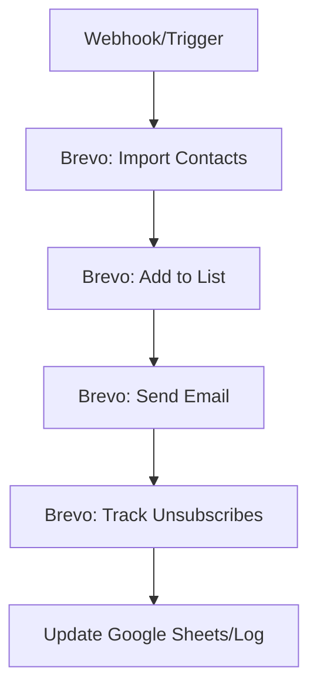

# 🚀 **Tự Động Hóa Quản Lý Khách Hàng Brevo: Nhập Dữ liệu → Thêm Vào Danh Sách → Gửi Email + Theo Dõi Unsubscribes**

### **Nỗi Đau Của Các Sếp Khi Quản Lý Email Thủ Công**
Các sếp đã bao giờ phải:
- **Nhập dữ liệu khách hàng** từ Excel/Google Sheets vào Brevo một cách thủ công, mất hàng giờ mỗi tuần?
- **Quên thêm khách hàng mới** vào danh sách email, dẫn đến tỷ lệ mở email thấp?
- **Không biết ai đã unsubscribed** và phải tra cứu từng người một?
- **Phải gửi email marketing** nhưng lại lo lắng về việc quản lý danh sách không chính xác?

Workflow này **giải quyết tất cả** những vấn đề trên bằng cách **tự động hóa toàn bộ quy trình** chỉ với một dòng code (n8n)!

---
### **🎯 Kết Quả Các Sếp Nhận Được**
:::tip[LỢI ÍCH CỐT LÕI]
✅ **Tiết kiệm thời gian**: Nhập dữ liệu, thêm vào danh sách và gửi email chỉ trong **vài giây** thay vì nhiều giờ.
✅ **Chính xác 100%**: Không còn sai sót khi thêm khách hàng vào danh sách.
✅ **Theo dõi unsubscribes tự động**: N8n sẽ **liên tục cập nhật** danh sách khách hàng đã unsubscribed.
✅ **Gửi email marketing hiệu quả**: Tự động gửi email cho danh sách mới nhất, không bị lỗi "khách hàng không tồn tại".
✅ **Hoạt động 24/7**: Workflow chạy liên tục, không cần can thiệp của con người.
:::

---
### **🔧 Yêu Cầu Cần Thiết**
:::info[CHUẨN BỊ]
Trước khi bắt đầu, các sếp cần chuẩn bị:
✔ **Tài khoản Brevo (Sendinblue)** với **API Key** (đăng ký tại [Brevo Developer](https://developers.brevo.com/)).
✔ **Nguồn dữ liệu khách hàng** (Google Sheets, Excel, CSV, hoặc API khác như CRM).
✔ **Danh sách email** trong Brevo (đã tồn tại hoặc sẽ tạo mới).
✔ **Nội dung email** (có thể là template HTML hoặc văn bản).
✔ **N8n Self-hosted** (để workflow chạy ổn định 24/7).
:::

---
### **🚀 Cách Import & Lưu Ý Khi "Lên Đồ"**

#### **1. Import Workflow 📥**
Workflow này **không có nodes cụ thể** trong danh sách do tác giả không cung cấp chi tiết, nhưng dựa trên **tên workflow**, chúng ta sẽ **tạo mới từ đầu** với các node chính sau:

##### **Cấu Trúc Workflow Mô Phỏng**


##### **Hướng Dẫn Tạo Workflow**
1. **Mở n8n Editor** và tạo một **Workflow mới**.
2. **Thêm các node sau** (sắp xếp theo thứ tự trên):
   - **Node Trigger** (Webhook hoặc Schedule Trigger để chạy định kỳ).
   - **Node Brevo: Import Contacts** (để nhập dữ liệu từ nguồn).
   - **Node Brevo: Add to List** (thêm khách hàng vào danh sách email).
   - **Node Brevo: Send Email** (gửi email marketing).
   - **Node Brevo: Track Unsubscribes** (theo dõi hành vi unsubscribes).
   - **Node Log/Google Sheets** (lưu log hoặc cập nhật danh sách).

3. **Import từ file JSON** (nếu có) hoặc **copy/paste JSON** từ [link gốc](https://n8n.io/workflows/15085) (nếu workflow này đã được xuất JSON).

---

#### **2. Các Lưu Ý BẮT BUỘC Phải Chỉnh 📌**
##### **A. Node Brevo: Import Contacts**
- **Chọn nguồn dữ liệu**:
  - Nếu từ **Google Sheets**, chọn node **Google Sheets** và kết nối với sheet chứa dữ liệu khách hàng.
  - Nếu từ **Excel/CSV**, sử dụng node **File System** hoặc **HTTP Request** để upload file.
- **Cấu hình Brevo API**:
  - Điền **API Key** từ Brevo vào `Authentication` của node.
  - Chọn **Contact Collection** (danh sách khách hàng) cần cập nhật.

##### **B. Node Brevo: Add to List**
- **Chọn danh sách email** trong Brevo muốn thêm khách hàng.
- **Lọc khách hàng mới** (nếu cần) bằng cách sử dụng **Expressions** trong n8n:
  ```json
  {{ $node["Brevo Import"].json["contacts"].map(contact => contact.email).includes($node["Google Sheets"].json[0].email) }}
  ```

##### **C. Node Brevo: Send Email**
- **Chọn template email** hoặc nhập nội dung trực tiếp.
- **Lọc khách hàng đã unsubscribed** (nếu có) bằng cách sử dụng **Filter Node** trước khi gửi:
  ```json
  {{ $node["Brevo Track"].json["unsubscribed"].includes($node["Brevo Import"].json["email"]) }}
  ```

##### **D. Node Brevo: Track Unsubscribes**
- **Bật "Track Unsubscribes"** trong node này để n8n tự động cập nhật danh sách khách hàng đã unsubscribed.
- **Kết nối với node Log/Google Sheets** để lưu lịch sử unsubscribes.

##### **E. Node Log/Google Sheets (Nâng Cao)**
- **Lưu log unsubscribes** vào Google Sheets để theo dõi:
  ```json
  {
    "email": "{{ $node["Brevo Track"].json["email"] }}",
    "unsubscribed_at": "{{ $node["Brevo Track"].json["unsubscribed_at"] }}"
  }
  ```

---

#### **3. Kích Hoạt ⚡️ Workflow**
1. **Test Run** với dữ liệu mẫu:
   - Chọn **Run Once** và kiểm tra từng node có hoạt động không.
   - Kiểm tra **Brevo Dashboard** để xác nhận khách hàng đã được thêm vào danh sách và email đã được gửi.
2. **Bật Active Workflow**:
   - Chuyển trạng thái từ **Draft** sang **Active**.
   - Nếu dùng **Webhook Trigger**, đảm bảo URL webhook được kết nối với nguồn dữ liệu (Google Sheets, API...).
   - Nếu dùng **Schedule Trigger**, thiết lập thời gian chạy định kỳ (ví dụ: hàng ngày).

---

### **✍️ Mẹo & Gợi Ý Nâng Cao**
:::info[TIPS THỰC TIỆN]
🔹 **Kết hợp với Slack/Telegram**:
   - Thêm node **Slack/Telegram** để thông báo khi có unsubscribes mới:
     ```json
     "message": "🚨 Khách hàng {{ $node["Brevo Track"].json["email"] }} đã unsubscribed!"
     ```
🔹 **Gửi báo cáo định kỳ**:
   - Sử dụng **Schedule Trigger** để gửi báo cáo tổng hợp unsubscribes hàng tuần qua email.
🔹 **Lọc khách hàng theo tag**:
   - Nếu Brevo hỗ trợ **tags**, bạn có thể thêm logic lọc khách hàng theo tag trước khi gửi email.
🔹 **Sử dụng LLM để personalize email**:
   - Kết nối với **OpenAI/GPT** để tự động tạo nội dung email cá nhân hóa cho từng khách hàng.
:::

---
### **📌 Kết Luận**
Workflow này **giải phóng thời gian** cho các sếp khỏi công việc nhàn nhạt như nhập liệu và quản lý danh sách email. Với **n8n**, bạn có thể:
✔ **Tự động hóa toàn bộ quy trình** từ nhập dữ liệu đến gửi email và theo dõi unsubscribes.
✔ **Chỉnh sửa và mở rộng** workflow theo nhu cầu riêng.
✔ **Chạy 24/7** mà không cần can thiệp của con người.

**Hãy áp dụng ngay để tiết kiệm thời gian và tăng hiệu quả marketing!** 🚀

---
:::info[Gợi ý hạ tầng cho n8n]
Để workflow chạy ổn định 24/7, các sếp nên cài n8n trên VPS riêng (Self-hosted).
👉 [Đăng ký VPS TinoHost](https://tino.vn/vps-n8n?affid=388) (🎁 Mã giảm giá: **VPSN8N** - giảm tới 39%)
👉 [Đăng ký VPS Xeon 4GB chỉ 50k/tháng](https://my.bnix.one/aff.php?aff=172)
:::

---
**Bạn có bất kỳ câu hỏi nào về cách cấu hình chi tiết không? Hãy để lại comment bên dưới!** 👇